# Sample Hardhat Project

This project demonstrates a basic Hardhat use case. It comes with a sample contract, a test for that contract, and a script that deploys that contract.

Try running some of the following tasks:

```shell
npx hardhat help
npx hardhat test
REPORT_GAS=true npx hardhat test
npx hardhat node
npx hardhat run scripts/deploy.js
```
# Example commands

Initialize the Hardhat project
Creates the project structure, sample contract, and configuration file.
```shell
npx hardhat
```
Compile the smart contracts
Compiles all Solidity files in the contracts folder.
```shell
npx hardhat compile
```
Start a local blockchain
Starts a local Ethereum network with pre-funded test accounts.
```shell
npx hardhat node
``` 
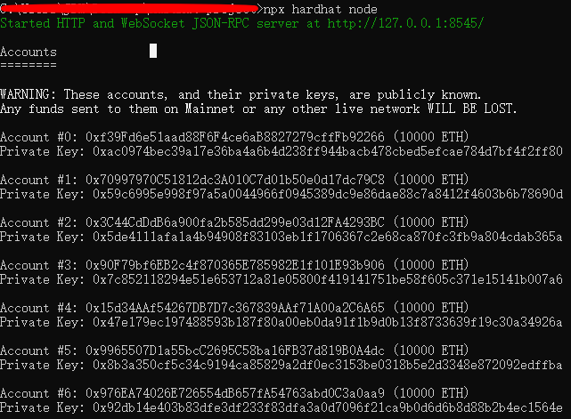

Return 20 accounts 

Open the Hardhat console (new terminal)
Opens an interactive console connected to the local blockchain.
```shell
npx hardhat console --network localhost
```
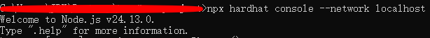

Get a test account (Hardhat console)
Retrieves the first test account to deploy and send transactions.
```shell
const [owner] = await ethers.getSigners()
```
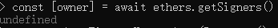 
Returning undefined is a feature of assignment statements; in fact, the owner variable is already ready.
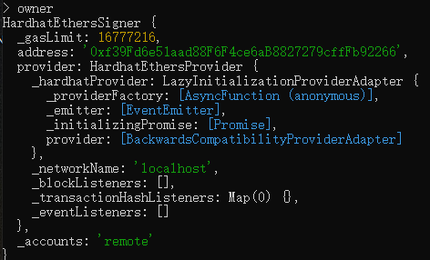


block chain log proof：eth_accounts asks the node "which accounts are there", hardhat_metadata checks the detailed information and finds the metadata of 20 accounts

Set an unlock time
Creates a timestamp 60 seconds in the future.
```shell
const unlockTime = Math.floor(Date.now() / 1000) + 60
```
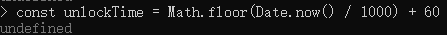


Loads the compiled Lock contract.
```shell
const Lock = await ethers.getContractFactory("Lock")
```
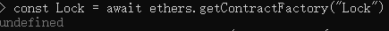
This step is telling Hardhat: "I want to deploy the Lock contract. Please prepare the ABI, Bytecode and Signer information."

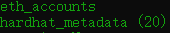
Blockchain log: Check the node to obtain Signer information, including address, public key, balance, etc.

Deploy the contract and send Ether
Deploys the contract and sends 1 ETH to it.
```shell
const lock = await Lock.deploy(unlockTime, { value: ethers.parseEther("1") })
```

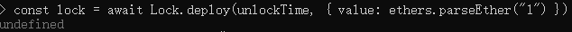
The deployment transaction has been submitted, but the contract instance is not fully ready.

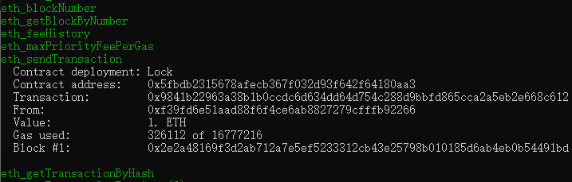
Blockchain log proof: The complete execution record of deploying the transaction, proving that the contract has been successfully created and put on the chain.

```shell
await lock.waitForDeployment()
```
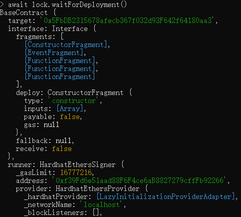
Return the contract instance, allowing users to continue calling the contract's functions, such as querying the contract owner, querying the unlock time, etc.

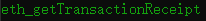
Blockchain log proof: Return the one-time receipt for this transaction.

Read contract state
Calls read-only functions to check stored values.
```shell
await lock.owner()
```
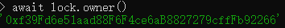
Query the current contract owner and return the address when the contract was deployed.

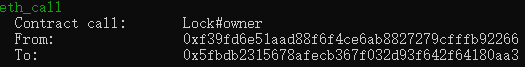

```shell
await lock.unlockTime()
```
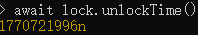

Query the next unlock time and return the timestamp when the contract was deployed.

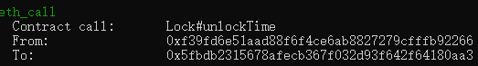

Withdraw funds
Withdraws funds after the unlock time has passed.
```shell
await lock.withdraw()
```
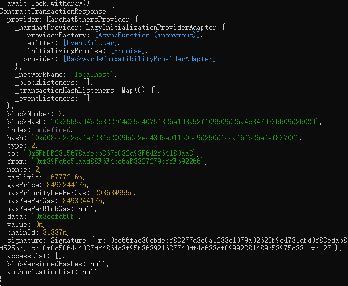
Withdraw the locked funds to the contract owner's address.

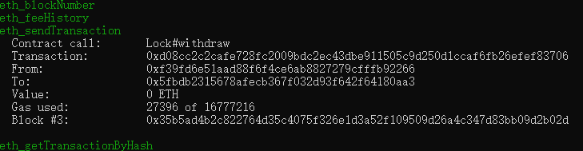
Withdrawal log: Check the node to obtain the transaction record of the withdrawal.

Exit the Hardhat console
Leaves the Hardhat interactive console.
```shell
.exit
```
Stop the local blockchain
Stops the local Hardhat network.
```shell
Ctrl + C
```

